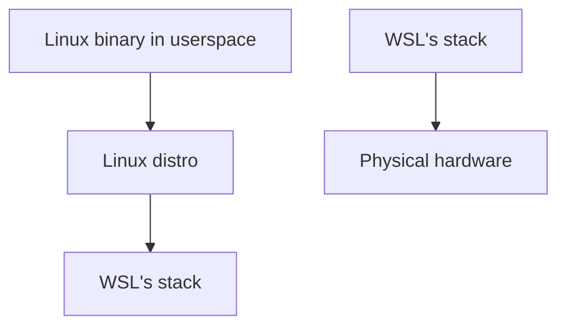

# Windows Subsystem for Linux Troubleshooting Guide

This guide goes over how to troubleshoot issues in WSL and determine where they are coming from.

## A quick note on architecture

To help determine what's causing an issue, we have to find out where it is in the stack.

When a Linux binary is called in WSL, it (approximately) goes through these layers, each could be where the error is coming from:

We'll be going through this stack in order, and guiding you on how to determine if the error source is from that section.

## Linux binary in userspace 

First we need to check if this is an error caused by the Linux binary itself. The easiest way to do this is just to see if this error reproduces on a real Linux machine (Either bare metal which is preferred, or run full Ubuntu in Hyper-V for a good comparison). If it errors out in the same way on a real Linux machine, then we know it's either the Linux binary or the distro.

Alternatively, you can run the `strace` command to determine what's going on. This command shows you the Linux system calls that the Linux binary is making, and you can determine what it is trying to access and where it might be failing. This guide won't give a full guide on how to debug `strace` stacks (or else it would be way too long), so let's take a look at an example:

A user finds the WSL command `xeyes` hangs in WSL, but doesn't hang on a Linux machine. Running `strace xeyes` shows that the command is hanging at the `openat` system call. This means that the Linux kernel is stuck trying to run the `openat` call, and would indicate the problem isn't in the binary itself.

### What to do if the problem is in the Linux binary

The Linux binaries present in WSL are provided by their respective owners, and aren't directly owned by Microsoft. If you do see an issue in the Linux binary please report it to the owner of that binary directly.

## Linux distro

Some errors might also come from the Linux distribution itself. Linux distros in WSL are really just a collection of Linux binaries, so the same troubleshooting steps as above apply. However, the Linux distro is responsible for key experiences like the package manager, which can greatly affect how binaries interact with each other. 

To troubleshoot this, you would use the same techniques as above, seeing if this reproduces on Linux, and using `strace` to determine what is causing the failure (Or any other error codes) and trying to determine if it comes from a specific Linux binary. If that binary itself is owned by the distro, then it's a Linux distro problem.

### What to do if the problem is in the Linux distro

Similar to the Linux binary story, WSL distros are provided by their respective maintainers. Please file the issue directly with the affected Linux distro.

## WSL's stack

Next, the error could be coming from within WSL's logic itself. If the issue doesn't reproduce on bare metal Linux, or something at the machine level is failing then these indicate that this is from within WSL. Below are the common failure paths and how to determine it and collect logs:

### WSL start up failures or errors from `wsl.exe`. 

The most obvious error here, is an error coming from `wsl.exe` directly, such as [this GitHub issue for example](https://github.com/microsoft/WSL/issues/10483). In this case please [collect WSL logs](https://aka.ms/wsllogs) that reproduces the issue and file the issue at the [WSL GitHub repo](https://github.com/microsoft/wsl).

### WSL hangs

Another common error is where WSL hangs and doesn't respond to any commands. In this case please [report a WSL process crash by following this process](https://github.com/microsoft/WSL/blob/master/CONTRIBUTING.md#11-reporting-a-wsl-process-crash). You can force a crash and collect a dump by opening Task Manager -> Processes -> Right clicking `VmmemWSL` -> Create Memory Dump file. Please include this crash dump and file an issue on the [WSL GitHub repo](https://github.com/microsoft/wsl).

### Network errors

Again, please verify this isn't a Linux binary issue. As well, if possible verify that this isn't a generic virtualization or VPN issue by trying a Hyper-V VM on that machine to see if it has restricted networking capabilities. If this problem is only persisting in WSL, then please file an issue on the [WSL GitHub repo](https://github.com/microsoft/wsl).

### Misc. Issues

If you are getting another kind of WSL error that you think is related to WSL specifically, please [include logs](https://aka.ms/wsllogs) and file it at the [WSL GitHub repo](https://github.com/microsoft/wsl).

## Diving into WSL logs

You can open up WSL logs to see what the exact error is. To do this please install [Windows Performance Analyzer](https://apps.microsoft.com/detail/9N0W1B2BXGNZ) first.

Then, when you have WSL logs (collected from [these instructions](https://aka.ms/wsllogs)), take the .zip file that is created and unzip it. Open the resulting folder and look for a file called: `logs.etl` and double click this file to open it up in Windows Performance Analyzer.

Once the app opens, do these steps:

1. Click System Activity to expand the view
2. Drag the "Generic Events" box at the top to the main window
3. Find the "Microsoft.Windows.Lxss.Manager" series and click the arrow to select it

From there, you can view all the diagnostic events that are emitted from WSL. The one of most interest will be called "VerboseLog" and will give more details on the exact error location and information about it.

## Additional resources

Common issues and solutions are available at the [WSL troubleshooting docs page](https://learn.microsoft.com/windows/wsl/troubleshooting), so please check there for any issues you might see. As well go to the [WSL GitHub repo](https://github.com/microsoft/wsl), or any search engine and search for the issue or any error codes there to see if others are hitting the same issue. 
